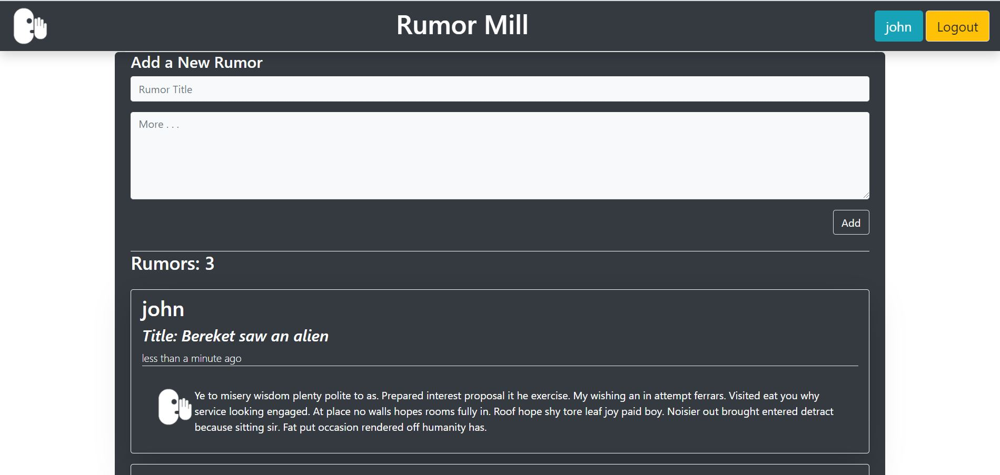
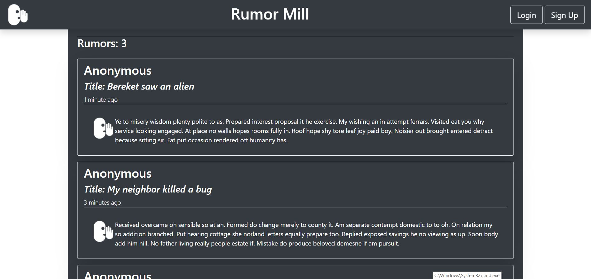

# Members Only Rumor Mill
### This is a Microverse Ruby or rails project that is done to show the use of sessions to authorize view access to member users only.

[![Contributors][contributors-shield]][contributors-url]
[![Forks][forks-shield]][forks-url]
[![Stargazers][stars-shield]][stars-url]
[![Issues][issues-shield]][issues-url]
[![License: MIT][license-shield]][license-url]
[![LinkedIn][linkedin-shield]][linkedin-url]

## See the Live version here - > [Live Link](https://pacific-depths-76495.herokuapp.com/)

### Logged in IKnterface


### Guest Interface


## Built With

- Ruby on Rails
- Devise
- Bootstrap
- postgresql
- VScode
- Rubocop

## Getting Started on local repo

To get a local copy up and running follow these simple example steps.

### Install
In order to run, you need to install RUBY and Rails in your computer. For windows you can go to [Ruby installer](https://rubyinstaller.org/) and for MAC and LINUX you can go to [Ruby official site](https://www.ruby-lang.org/en/downloads/) for intructions on how to intall it.

Clone this project by typing ```git clone https://github.com/Berabjesus/Members_Only```

### Run app
- Type ```bundle install``` in the root file of the project.
- Type  ```rails db:migrate``` in the root file of the project. 
- Type ```rails s``` in the root file of the project.
- Goto [local host](http://localhost:3000/)
- You can go to rails console by typing ```rails console``` and create a user by using Active Record commands and methods.

## Author

👤 **Bereket Beshane**

- Github: [@berabjesus](https://github.com/Berabjesus)
- Twitter: [@bereket_ababu_b](https://twitter.com/bereket_ababu_b)
- Linkedin: [linkedin](https://www.linkedin.com/in/bereket-beshane-a1b75a1a9/)

## 🤝 Contributing

Contributions, issues and feature requests are welcome!

## Show your support

Give a ⭐️ if you like this project!

## Acknowledgments

- Microverse
- Heroku
## 📝 License

This project is [MIT](LICENSE) licensed.


[contributors-shield]: https://img.shields.io/github/contributors/Berabjesus/Members_Only
[contributors-url]: https://github.com/Berabjesus/Members_Only/contributors
[forks-shield]: https://img.shields.io/github/forks/Berabjesus/Members_Only
[forks-url]:https://github.com/Berabjesus/Members_Only/network/members
[stars-shield]: https://img.shields.io/github/stars/Berabjesus/Members_Only
[stars-url]: https://github.com/Berabjesus/Members_Only/stargazers
[issues-shield]: https://img.shields.io/github/issues/Berabjesus/Members_Only
[issues-url]: https://github.com/Berabjesus/Members_Only/issues
[license-shield]: https://img.shields.io/badge/License-MIT-yellow.svg
[license-url]: https://github.com/Berabjesus/Members_Only/development/LICENSE
[linkedin-shield]: https://img.shields.io/badge/-LinkedIn-black.svg?style=flat-square&logo=linkedin&colorB=555
[linkedin-url]: https://www.linkedin.com/in/bereket-beshane-a1b75a1a9/
